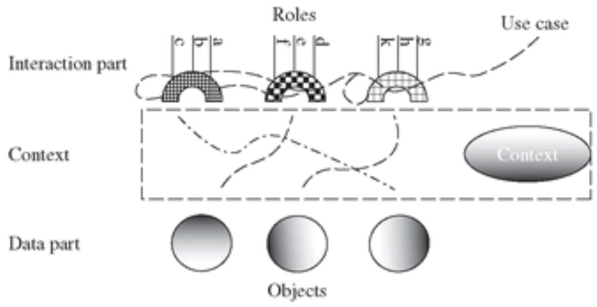

# DCI Architecture
#### Sequence of tasks (use cases) to achieve an end user goal
A sequence of tasks achieves some goal for an end user in a context.
These tasks are captured by use cases.

DCI minimises any gap existing between the programmer's mental model 
and the program actually executing in the computer.

##DCI in a Nutshell

Encapsule the "what the system does code" on a "per-scenario" basis.

DCI separates the architecture into _data_ part (what the system _is_) and
_interaction_ part (what the system _does_).

The _interaction_ (I) part becomes connected to the _data_ (D) 
part on an event-by-event basis by an object called _Context_ (C) --> *DCI*

Data objects == Dumb domain entities, end user mental model. No operations, only domain properties.

Interaction expresses Use Case.

Each environment (e.g. MVC Controller object) finds a context, depending on an event that occurs,
that understands the objectrole-to-object mapping for the use case triggered by that event.

Each domain object can play an object _role_.

The controller wires up the object roles to the objects, and then starts the execution by 
invoking the _object role method_ that initiates the use cases (trigger).

Each object can play several object roles, and a given object role may be played by a 
combination of several objects together.

##Overview of DCI

